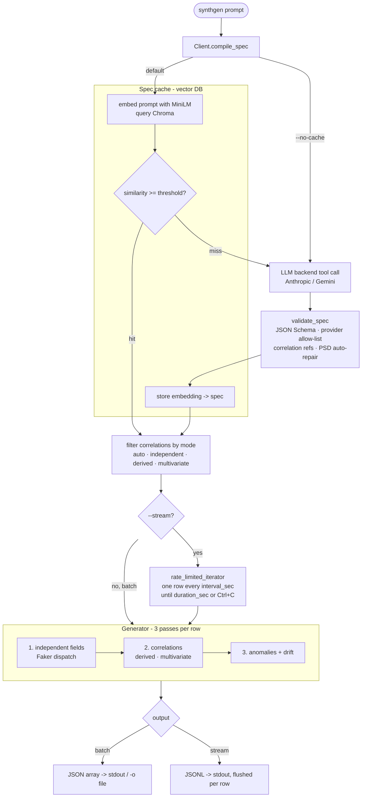

# Synthgen

**Conversational synthetic data generation — prompt-driven, pluggable LLM backends.**

Generate realistic synthetic data from natural-language prompts. Ships with **Anthropic Claude** and **Google Gemini** backends — pick whichever you have an API key for. The backend interface is pluggable, so adding OpenAI, Azure OpenAI, or local models (Ollama) later is purely additive.

```bash
$ synthgen "50 fake e-commerce orders from the last 30 days" --count 50 --pretty
[
  {
    "order_id": "8e2b…",
    "customer_email": "alice@example.com",
    "amount": 142.18,
    "currency": "USD",
    "ordered_at": "2025-04-18T14:22:31"
  },
  …
]
```

## Installation

Pick the backend(s) you want. The core package is small; LLM SDKs are extras you opt into.

```bash
# Claude (recommended)
pip install "synthgen[anthropic]"

# Or Gemini
pip install "synthgen[gemini]"

# Or both
pip install "synthgen[all]"
```

Requires Python 3.10 or newer.

## Configuration

### Using Claude (recommended)

1. Get an API key from <https://console.anthropic.com/>
2. Export it:
   ```bash
   export ANTHROPIC_API_KEY="sk-ant-***"
   ```

### Using Gemini

1. Get an API key from <https://aistudio.google.com/apikey>
2. Export it:
   ```bash
   export GOOGLE_API_KEY="..."
   ```
   (Or `GEMINI_API_KEY` — either works.)

That's it — no cloud project, no service account, no AWS, no anything else.

## CLI usage

```bash
# Basic — backend auto-detected from your env vars
synthgen "100 fake users with names, emails, and Bay-Area cities" --count 100

# Force a specific backend
synthgen "100 IoT sensors" --backend anthropic
synthgen "100 IoT sensors" --backend gemini

# Pretty-printed, written to a file
synthgen "50 product reviews with ratings 1–5" --count 50 --pretty -o reviews.json

# Deterministic — same seed always produces the same output
synthgen "20 IoT sensor readings" --count 20 --seed 42

# Debug a prompt — see what spec the LLM produced, without generating records
synthgen "factory temperature sensors" --spec-only --pretty

# Stream — emit one record at a time, forever (Ctrl+C to stop).
# Default cadence is one record every 5 seconds.
synthgen "IoT temperature sensors" --stream

# Stream faster, and stop after 60 seconds
synthgen "IoT temperature sensors" --stream --interval 0.5 --duration 60

# The prompt itself can set the cadence — no flag needed
synthgen "IoT sensors, one reading every 2 seconds" --stream

# By default, similar prompts are served from a local vector-DB cache
# (one record per unique prompt). To force a fresh LLM call, opt out:
synthgen "100 fake users with names" --no-cache

# Correlated fields — the LLM reads the relationship from the prompt
synthgen "factory sensors — humidity inversely correlates with temperature" --count 100

# Force a correlation mode (overrides whatever the LLM picked)
synthgen "factory readings, temp + humidity + pressure correlated" --correlation multivariate
synthgen "factory readings"  --correlation independent   # ignore any correlations

# Use a different model
synthgen "..." --backend anthropic --model claude-sonnet-4-6
synthgen "..." --backend gemini --model gemini-2.5-pro
```

### Exit codes

| Code | Meaning |
|------|---------|
| 0    | Success |
| 1    | Backend transport error (auth, network, throttling) |
| 2    | Spec validation failed — LLM produced an invalid spec |
| 3    | Generator bug — please [file an issue](https://github.com/example/synthgen/issues) |
| 130  | Interrupted by user (Ctrl+C) |

## Python SDK usage

```python
from synthgen import Client
from synthgen.backends import AnthropicBackend

client = Client(backend=AnthropicBackend())  # reads ANTHROPIC_API_KEY from env

# Batch — get a list of records back
records = client.generate(
    "100 fake users with names, emails, and Bay-Area cities",
    count=100,
)

# Stream — yield records at a fixed interval, sink-agnostic.
# Default cadence is one record every 5 seconds. Override with
# interval_sec, or let the prompt set it ("...every 2 seconds...").
for record in client.stream(
    "IoT temperature sensors, 4 sensors, occasional spikes",
    interval_sec=0.1,   # 10 records/sec; omit for the 5s default
    duration_sec=60,
):
    publish_to_my_broker(record)

# Spec-only — inspect or modify the spec before generation
spec = client.compile_spec("100 product reviews")
print(spec.dataset_name, len(spec.fields))

# Generate from a hand-crafted or saved spec — no LLM call needed
records = client.generate_from_spec(spec, count=50, seed=42)
```

### Switching backends

The Client takes any backend implementing the `Backend` protocol. Same code,
different provider:

```python
from synthgen import Client
from synthgen.backends import AnthropicBackend, GeminiBackend

# Use Claude
client = Client(backend=AnthropicBackend(model="claude-haiku-4-5"))

# Use Gemini
client = Client(backend=GeminiBackend(model="gemini-2.5-flash"))

# Use Claude with explicit key + different model
client = Client(backend=AnthropicBackend(
    api_key="sk-ant-...",
    model="claude-sonnet-4-6",      # for harder prompts
    temperature=0.2,
    max_tokens=2048,
))
```

## How it works

End-to-end flow when you run `synthgen "..."`:



Stage-by-stage:

1. **Compile.** The natural-language prompt becomes a typed `Spec` (dataset name, fields, optional streaming cadence, optional correlations). Either the LLM produces it via an `emit_spec` tool call, or the semantic cache reuses a previously-compiled spec for a similar prompt.
2. **Cache.** The prompt is embedded with a local sentence-transformers model (MiniLM, ~80MB) and looked up in a persistent Chroma collection. Identical prompts always hit; paraphrases hit if cosine similarity is above the threshold (default 0.85).
3. **Validate.** The raw spec is checked against the JSON Schema, the provider allow-list, and — for correlations — that referenced fields exist, are numeric, and that multivariate matrices are positive semi-definite (auto-repaired to the nearest PSD when not).
4. **Filter.** `--correlation` lets you override whatever the LLM emitted: `independent` strips all correlations, `derived` / `multivariate` keeps only that mode, `auto` (default) keeps everything.
5. **Generate.** Per row, three deterministic passes — independent Faker draws, then correlation overwrites, then anomalies (including stateful drift). Multivariate uses a precomputed Cholesky factor; derived is a linear function of one source field plus Gaussian noise.
6. **Emit.** Batch mode prints a JSON array and exits. Stream mode prints one compact JSON record per line (JSONL), flushed immediately, until `--duration` elapses or you Ctrl+C.

## Docker / EC2 deployment

The repo ships a `Dockerfile` that packages synthgen as a containerised
CLI — the image's entrypoint *is* the `synthgen` command, so the
container behaves exactly like the local tool. The embedding model is
baked into the image, so it runs offline after the build.

```bash
# Build the image
docker build -t synthgen .

# One-off generation — prints JSON and exits
docker run --rm -e ANTHROPIC_API_KEY="$ANTHROPIC_API_KEY" \
  synthgen "100 fake users with names and emails" --backend anthropic --pretty

# Streaming — runs until you stop it (Ctrl+C, or `docker stop`)
docker run --rm -it -e ANTHROPIC_API_KEY="$ANTHROPIC_API_KEY" \
  synthgen "IoT temperature sensors" --stream --backend anthropic
```

The `-it` flags matter for streaming — they let Ctrl+C reach the
process. A streaming container also stops cleanly on `docker stop`.

On EC2:

1. Install Docker on the instance (`sudo yum install -y docker` on
   Amazon Linux, `sudo apt install -y docker.io` on Ubuntu), then
   `sudo systemctl enable --now docker`.
2. Build the image on the box, or push it to ECR and `docker pull` it.
3. Run it. Pass the API key with `-e` — or, better, pull it from SSM
   Parameter Store / Secrets Manager in your launch script. Never bake
   keys into the image.

## What synthgen can generate

Supported field providers (see `synthgen._schema.ALLOWED_PROVIDERS` for the full list):

- **Person:** `name`, `first_name`, `last_name`, `email`, `phone_number`, `job`
- **Location:** `address`, `city`, `country`, `country_code`, `latitude`, `longitude`
- **Internet:** `ipv4`, `url`, `user_agent`, `user_name`
- **Business:** `company`, `currency_code`, `credit_card_number`
- **Identifiers:** `uuid4`
- **Date/time:** `date_time_between`, `date_between`, `time`
- **Numerics:** `pyfloat`, `pyint` (with `uniform` / `normal` / `exponential` distributions)
- **Choice:** `random_element`
- **Text:** `sentence`, `word`, `text`, `bothify`

Anomaly types: `null`, `outlier`, `stuck_value`, `spike`, `duplicate`, `drift`, `invalid_format`.

## Current limits

- Maximum 200 rows per `generate()` call. For larger datasets, call repeatedly with different seeds, or use `stream()`.
- Two LLM backends shipped: Anthropic Claude and Google Gemini. OpenAI / Azure / Ollama support is planned.
- Synchronous client only. `AsyncClient` is planned for the next release.

## Open in VS Code

The repo ships with a `.vscode/` workspace config so the editor is pre-set
the moment you open it:

```bash
unzip synthgen.zip
cd synthgen
python -m venv .venv && source .venv/bin/activate    # Windows: .venv\Scripts\activate
pip install -e ".[dev]"
code .
```

When VS Code opens, it will:

- Pick the right Python interpreter (`.venv/bin/python`).
- Offer to install the recommended extensions (Python, Pylance, Ruff, mypy, …).
- Format Python files on save with ruff and organize imports.
- Run mypy in the background so type errors show inline.
- Auto-discover the 72 unit tests — open the **Testing** sidebar (flask icon)
  to run/debug any of them with a click.
- Provide F5 debug launches for the CLI and for the test file you have open.
- Expose tasks like *Run unit tests*, *Lint (ruff)*, *Type-check (mypy)*,
  *All checks* via **Cmd/Ctrl+Shift+P → Run Task**.

To debug the CLI with your own prompt, choose **CLI: synthgen (prompt-on-launch)**
from the Run and Debug dropdown and press F5 — VS Code will ask for the prompt
each time. (Make sure `GOOGLE_API_KEY` is exported in the shell that launched VS Code.)

## Development

```bash
git clone https://github.com/example/synthgen
cd synthgen
pip install -e ".[dev]"

# Run the full test suite (no API key needed — uses MockBackend)
pytest

# Live eval against real Gemini (requires GOOGLE_API_KEY)
pytest -m eval

# Lint + type-check
ruff check
mypy src/synthgen
```

## License

Apache 2.0 — see [LICENSE](LICENSE).
